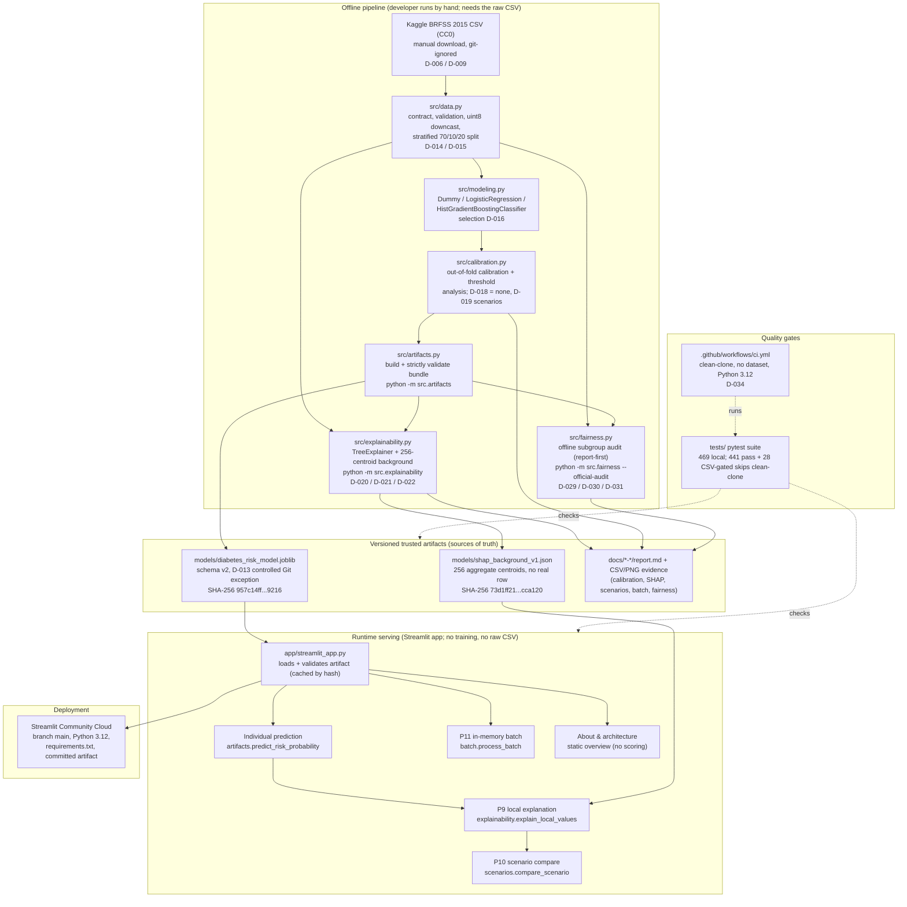

# Architecture

This page explains how the diabetes-risk-ml project fits together, from manual
data acquisition through offline model building to the Streamlit serving app and
its public deployment. Every component below maps to real repository code or an
Accepted decision in [decisions.md](decisions.md); the diagram intentionally
distinguishes what runs **offline** (once, by a developer) from what runs at
**runtime** (in the deployed app).

This is an educational portfolio project. It is not a medical device, and the
architecture is deliberately small: one offline training/analysis pipeline, two
versioned trusted artifacts, and a thin serving app that only loads and uses
them.

## Two execution contexts

The single most important architectural boundary is **offline analysis** versus
**runtime serving** (decision [D-007](decisions.md)).

- **Offline** code prepares data, trains and evaluates the model, runs
  calibration/threshold analysis, derives SHAP evidence, and runs the fairness
  audit. It reads the raw BRFSS CSV, is run by hand through `python -m ...`
  entry points, and writes the two versioned artifacts and the `docs/` evidence.
- **Runtime** code (`app/streamlit_app.py`) never trains, calibrates, downloads
  a model, or reads the raw CSV. It loads the committed artifacts, validates
  them, and serves probabilities. This separation is enforced by source-guard
  tests in `tests/test_app.py`.

## Data provenance

- **Source:** the [Diabetes Health Indicators Dataset](https://www.kaggle.com/datasets/alexteboul/diabetes-health-indicators-dataset)
  (`diabetes_binary_health_indicators_BRFSS2015.csv`), derived from the CDC's 2015
  Behavioral Risk Factor Surveillance System (BRFSS). License: CC0.
- **Acquisition:** manual download to `data/raw/` (decisions D-006, D-009); the
  raw CSV is never committed. See [data/README.md](../data/README.md).
- **Shape:** 253,680 rows, 21 features, binary target `Diabetes_binary`
  (~13.9% positive). Exact duplicate rows are kept (D-014).
- **Contract:** `src/data.py` fixes the column order, feature groups (14 binary,
  4 ordinal, 3 numeric), and inclusive value ranges (`VALUE_RANGES`), validates
  the raw frame, downcasts to `uint8`, and produces a reproducible stratified
  70/10/20 train/calibration/test split in memory (D-015).

## Offline pipeline

| Stage | Code | Entry point | Output | Decisions |
|---|---|---|---|---|
| Data prep + splits | `src/data.py` | `prepare_data()` | in-memory splits | D-014, D-015 |
| Baselines + comparison | `src/modeling.py` | `compare_models()` | in-memory metrics | D-016 |
| Calibration + thresholds | `src/calibration.py` | offline P8 workflow | `docs/p8-calibration/` | D-018, D-019 |
| Artifact build | `src/artifacts.py` | `python -m src.artifacts` | `models/diabetes_risk_model.joblib` | D-010, D-013, D-017 |
| SHAP evidence | `src/explainability.py` | `python -m src.explainability` | `models/shap_background_v1.json`, `docs/p9-explainability/` | D-020, D-021, D-022 |
| Fairness audit | `src/fairness.py` | `python -m src.fairness --official-audit` | `docs/p12-fairness/` | D-029, D-030, D-031 |

The selected model is a `HistGradientBoostingClassifier` with library defaults
and a fixed seed (D-016), trained on the train split only. P8 evaluated sigmoid
and isotonic calibration out-of-fold and selected `calibration_method = none`
(D-018), so the served probability is the frozen model's raw positive-class
`predict_proba`. D-019 keeps the product probability-only: no decision threshold
and no risk label are served.

## Sources of truth (versioned artifacts)

Two artifacts are the runtime sources of truth. Their SHA-256 values are
verification anchors used across tests and documentation:

| Artifact | Purpose | SHA-256 |
|---|---|---|
| `models/diabetes_risk_model.joblib` | schema-version-2 serving bundle (frozen model + metadata) | `957c14ff5a490bbc60822121a889f92ee2a6a20f797eef741a710d887ecc9216` |
| `models/shap_background_v1.json` | 256 aggregate centroids for the runtime explainer | `73d1ff21e3c98ee79fa7d72758517047f13e5f454d7ff95edb1ee93812cca120` |

The model bundle is the D-013 **controlled Git exception**: only this one file
under `models/` is version-controlled (every other `models/*.joblib` stays
git-ignored), so the deployed app finds it without a network download.

## Runtime serving

`app/streamlit_app.py` is a thin UI over `src.artifacts`. On start it computes
the artifact's SHA-256, loads and validates the bundle once (cached under that
hash), and offers one top-level navigation radio with three sections (D-032):

- **Individual prediction (default):** collects the 21 features, validates them
  against `VALUE_RANGES`, assembles a one-row frame in exact `FEATURE_COLUMNS`
  order, and shows the positive-class probability. After a valid submission it
  progressively reveals the P9 local explanation and the P10 one-field scenario.
- **Batch CSV prediction:** parses a bounded (≤ 2 MiB, ≤ 1,000 rows) UTF-8 CSV
  entirely in memory, validates each row, scores valid rows through the same
  probability contract, and offers a deterministic result download (D-026–D-028).
- **About & architecture:** a static overview that performs no scoring and loads
  no raw data or offline evidence.

The runtime explanation loads the committed 256-centroid background and builds a
`TreeExplainer` cached under the artifact hash (D-022); it never derives the
background or reads the CSV. Session state is transient and bound to the artifact
hash: a failed rescore, an artifact-hash change, or an upload replacement clears
any prior result before anything stale can render.

## Trust boundary for the joblib artifact

A `joblib` file is an executable Python pickle, so loading one from an untrusted
source is unsafe. This project keeps the artifact trustworthy by construction
(D-013, D-035):

1. **Trusted source:** the artifact is loaded only from the reviewed repository,
   never downloaded or accepted from a user at runtime (source-guard tests
   forbid remote sources in the app). Git provenance and review are the root of
   trust for the executable pickle.
2. **Hash tracking and binding:** the official SHA-256 is recorded and checked
   in documentation/tests. At runtime the computed hash binds cached resources,
   saved results, and the SHAP background to the same artifact. It is not a
   hard-coded allowlist or authenticity check for the model file itself.
3. **Post-deserialization semantic validation:** after `joblib.load()`,
   `validate_artifact_bundle()` checks the bundle layout, schema version, model
   class and hyperparameters, fitted feature order, classes `[0, 1]`, the
   calibration/threshold metadata, and recorded vs. runtime package versions.
   This rejects unusable serving contracts but cannot make an untrusted pickle
   safe, because pickle code can execute during deserialization.
4. **Pinned environment:** Python 3.12 and the exact `requirements.txt` pins.

D-035 evaluated migrating to `skops` and chose to **retain** this controlled
`joblib` contract for the portfolio. `skops` would provide meaningful
defense-in-depth against malicious, tampered, or otherwise untrusted files, but
would not remove scikit-learn's cross-version compatibility constraint. Given
the accepted trusted-repository threat model, the migration and its cascade
through both artifact hashes are recorded as separate future hardening work,
not performed in this project.

## Privacy boundaries

- No raw BRFSS row, target, or split index is ever published. The SHAP
  background is 256 aggregate centroids with no exact row match (D-021).
- Uploaded batch bytes and results stay in active-session memory only; project
  code does not write them to disk, log them, or place them in a shared cache
  (D-028).
- The published SHAP and scenario evidence uses only the four **synthetic**
  public reference profiles (`tests/reference_profiles.py`).
- The fairness audit publishes only aggregates (D-031).

## Tests and CI

- `tests/` holds the pytest suite: the final local P13 run passed all 469 tests.
  In the final clean-clone run without the raw CSV, 28 explicitly CSV-gated
  tests skipped and the remaining 441 passed.
- Coverage spans the data contract, modeling/selection, the artifact contract
  and validator, headless app behavior, SHAP fidelity, scenario algebra, the
  batch contract, the fairness engine, and the deployment reference profiles.
- `.github/workflows/ci.yml` (D-034) runs the clean-clone subset on
  `ubuntu-latest` with Python 3.12 and least privilege (`contents: read`),
  without the dataset, credentials, training, or artifact writes. The complete
  raw-data suite remains a local closure gate.

## Deployment

The app is deployed on Streamlit Community Cloud from branch `main`, entry point
`app/streamlit_app.py`, Python 3.12, the pinned `requirements.txt`, and the
D-013 committed artifact. The platform copies the repository and runs
`streamlit run` from the root; there is no build step, and the app performs no
training or download at runtime. The public URL is in the [README](../README.md).

## Non-goals

This project deliberately does **not**:

- diagnose, screen for, or rule out diabetes, or give medical advice (D-004);
- apply a decision threshold or emit a high/low-risk label (D-019);
- claim causal, clinical, or production-scale validity;
- certify fairness — the P12 audit is descriptive and population-level (D-031);
- support loading untrusted artifacts (D-013, D-035);
- add accounts, persistence, analytics, external logging, or remote model/data
  fetches.

## Where to read more

- Decisions: [decisions.md](decisions.md)
- Roadmap and backlog: [roadmap.md](roadmap.md), [backlog.md](backlog.md)
- Calibration: [p8-calibration/report.md](p8-calibration/report.md)
- Explainability: [p9-explainability/report.md](p9-explainability/report.md)
- Scenarios: [p10-scenarios/report.md](p10-scenarios/report.md)
- Batch: [p11-batch/report.md](p11-batch/report.md)
- Fairness: [p12-fairness/report.md](p12-fairness/report.md)
- Portfolio narratives: [portfolio-summary.md](portfolio-summary.md)
- Demo assets: [p13-portfolio/](p13-portfolio/)
