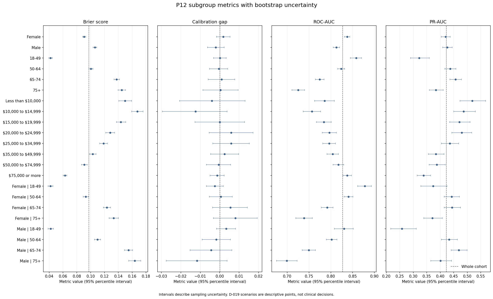
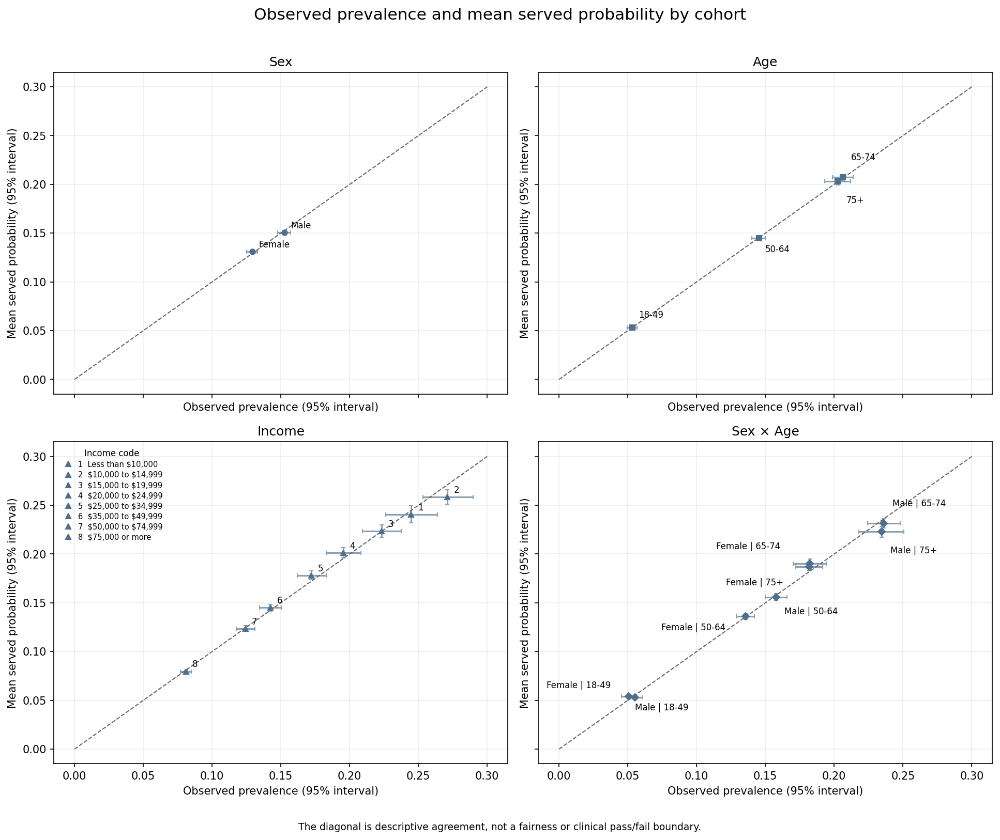

# P12 Fairness Audit Technical Report

**Local evidence date:** 2026-07-17

**Decisions:** D-029, D-030, and D-031 (Accepted before official test scoring)

**Reproduction:** `python -m src.fairness --official-audit`

## Objective and scope

P12 audits the behavior of the frozen P8 positive-class probability contract across predeclared demographic and socioeconomic cohorts. It is a descriptive, uncertainty-aware audit, not a fairness certification. The model is not retrained, recalibrated, reweighted, compared, or mitigated; no threshold is optimized and no group-specific decision rule is created.

The audited contract remains the D-016 `HistGradientBoostingClassifier`, artifact schema version 2, D-018 `calibration_method = none`, and D-019 probability-only product. P9 explanations, P10 scenarios, P11 batch behavior, and `app/streamlit_app.py` are unchanged.

## Ordered execution and decision gates

1. The official model and SHAP-background hashes, schema, D-018 outcome, four D-019 scenarios, and four synthetic reference probabilities were recorded and verified.
2. `calibration_support.csv` was generated through `prepare_data()` from calibration only. It contains no subgroup model-performance result. Calibration has 25,368 rows; test has 50,736, exactly twice calibration.
3. D-029 accepted the predeclared cohorts and the 500-row/100-positive/100-negative reporting floor. The calibration table and acceptance are unstaged working-tree changes intended to be versioned together after human review; the table was not already versioned during execution.
4. The pure engine and synthetic tests froze formulas, common bins, unavailable states, ordering, seed, resampling, and `group - whole cohort` direction.
5. The exact 5,000-resample calibration benchmark passed the project operational limits before D-030 was accepted. Calibration arrays were used only for computational feasibility; their subgroup metrics are neither published nor interpreted.
6. D-031 accepted report-first publication: complete aggregate evidence in GitHub documentation, a concise README summary, no Streamlit fairness section, and no P12 deployment gate.
7. Only after all three decisions were Accepted did the workflow score the unchanged P3 test split and generate the official audit.

## Cohorts and semantics

- **Sex:** dataset codes 0/1, labeled Female/Male by the existing feature-label contract. This historical binary field does not cover all sex characteristics or gender identities.
- **Age:** BRFSS ordinal codes grouped as 18-49 (1-6), 50-64 (7-9), 65-74 (10-11), and 75+ (12-13).
- **Income:** all eight original ordinal household-income categories, without regrouping.
- **Intersection:** Sex × Age only, in the fixed Sex-then-Age order.

Every row belongs to exactly one group on each declared axis. No cohort was selected, merged, hidden, renamed, or removed after official results were observed.

## Support

| Axis | Group | Rows | Positive | Negative | Prevalence | Supported |
|---|---|---|---|---|---|---|
| whole | Whole test cohort | 50736 | 7069 | 43667 | 0.139329 | True |
| sex | Female | 28531 | 3685 | 24846 | 0.129158 | True |
| sex | Male | 22205 | 3384 | 18821 | 0.152398 | True |
| age | 18-49 | 14849 | 790 | 14059 | 0.053202 | True |
| age | 50-64 | 17968 | 2609 | 15359 | 0.145203 | True |
| age | 65-74 | 11259 | 2321 | 8938 | 0.206146 | True |
| age | 75+ | 6660 | 1349 | 5311 | 0.202553 | True |
| income | Less than $10,000 | 1941 | 475 | 1466 | 0.244719 | True |
| income | $10,000 to $14,999 | 2325 | 630 | 1695 | 0.270968 | True |
| income | $15,000 to $19,999 | 3162 | 706 | 2456 | 0.223276 | True |
| income | $20,000 to $24,999 | 3990 | 779 | 3211 | 0.195238 | True |
| income | $25,000 to $34,999 | 5174 | 890 | 4284 | 0.172014 | True |
| income | $35,000 to $49,999 | 7281 | 1037 | 6244 | 0.142425 | True |
| income | $50,000 to $74,999 | 8730 | 1084 | 7646 | 0.124170 | True |
| income | $75,000 or more | 18133 | 1468 | 16665 | 0.080957 | True |
| sex_x_age | Female \| 18-49 | 8193 | 453 | 7740 | 0.055291 | True |
| sex_x_age | Female \| 50-64 | 10071 | 1364 | 8707 | 0.135438 | True |
| sex_x_age | Female \| 65-74 | 6191 | 1125 | 5066 | 0.181715 | True |
| sex_x_age | Female \| 75+ | 4076 | 743 | 3333 | 0.182287 | True |
| sex_x_age | Male \| 18-49 | 6656 | 337 | 6319 | 0.050631 | True |
| sex_x_age | Male \| 50-64 | 7897 | 1245 | 6652 | 0.157655 | True |
| sex_x_age | Male \| 65-74 | 5068 | 1196 | 3872 | 0.235991 | True |
| sex_x_age | Male \| 75+ | 2584 | 606 | 1978 | 0.234520 | True |

All official test groups meet D-029. Groups below the floor would retain support and prevalence while every other field remained explicitly unavailable; one-class ranking metrics also have an explicit unavailable state.

## Exact metric definitions

For labels `y_i in (0, 1)`, served probabilities `p_i`, and group size `n`:

- Prevalence: `(1 / n) * sum_i(y_i)`.
- Mean served probability: `(1 / n) * sum_i(p_i)`.
- Brier score: `(1 / n) * sum_i((p_i - y_i)^2)`.
- Log loss: `-(1 / n) * sum_i(y_i * log(p_i) + (1 - y_i) * log(1 - p_i))`, with the same float64 machine-epsilon clipping convention as P8.
- ROC-AUC: within-group positive-versus-negative ranking probability with score ties receiving half credit; both classes are required.
- PR-AUC: scikit-learn average precision on the within-group ranking; both classes are required.
- Signed calibration gap: mean served probability minus observed prevalence. Positive values mean the mean estimate is higher than observed prevalence; negative values mean it is lower.
- Recall: $TP/(TP+FN)$; precision: $TP/(TP+FP)$; false-positive rate: $FP/(FP+TN)$.
- Every gap is exactly `group metric - whole-cohort metric`; its sign is directional, not an approval category.

False-positive and false-negative counts are published as descriptive counts without bootstrap intervals or gap calculations. Intervals cover the normalized probability metrics (including prevalence) plus recall, precision, and false-positive rate at the four D-019 scenarios. Reliability-bin statistics and counts do not receive intervals.

## Reliability data

All groups use the same ten equal-width bins: `[0.0, 0.1)`, `[0.1, 0.2)`, ..., `[0.9, 1.0]`; exactly 1.0 belongs to the last bin. Empty bins remain explicit with `status = unavailable` and `unavailable_reason = empty_bin`. The fixed-bin reliability data are published in `official_test_reliability.csv`. The separate `calibration_by_group.png` visualizes calibration-in-the-large by comparing each cohort's observed prevalence with its mean served probability.

## Bootstrap and computational benchmark

The uncertainty contract uses 5,000 ordinary nonparametric resamples of the complete audited split with replacement, NumPy seed 42, and percentile 95% intervals. Whole-cohort and subgroup metrics are recomputed from the same multiplicity weights in each resample, so gap samples preserve their dependence. Undefined degenerate resamples are excluded metric-by-metric and counted in `valid_resamples`; all official eligible results retained all 5,000 resamples.

The calibration benchmark measured 60.472 warm seconds and 335.430 MiB incremental Python peak memory. It passed the frozen project limits of 600 seconds and 512 MiB. These are project operational guardrails, not statistical standards. The intervals are descriptive; no significance test, multiple-comparison claim, universal tolerance, or fairness pass/fail threshold is used.

## Split provenance and environment

- P3 selected population: 253,680 BRFSS 2015 rows with exact duplicates retained (D-014).
- Train: 177,576 rows; calibration: 25,368; test: 50,736.
- Calibration selected only cohort feasibility and benchmark viability. It supplied no published P12 subgroup-performance claim.
- Official P12 evidence uses test only after D-029 through D-031 were frozen. Test was already used in P5 model selection and P8 evaluation, so it is not described as pristine or once-only.
- Feature order: exact 21-column `FEATURE_COLUMNS` contract.
- Packages: python 3.12.7, numpy 2.2.6, pandas 2.3.1, scikit_learn 1.7.1, joblib 1.5.1, matplotlib 3.10.3.

## Artifact identity and serving regression

- `models/diabetes_risk_model.joblib`: `957c14ff5a490bbc60822121a889f92ee2a6a20f797eef741a710d887ecc9216`.
- `models/shap_background_v1.json`: `73d1ff21e3c98ee79fa7d72758517047f13e5f454d7ff95edb1ee93812cca120`.
- Artifact schema: 2.
- Calibration method: `none`.
- D-019 scenarios: default_half=0.50, max_f1=0.25, recall_floor_050=0.29, recall_floor_075=0.15.
- Synthetic reference probabilities/displays: 0.0030013847190188967 (0.3%), 0.6000009431177805 (60.0%), 0.699987950051215 (70.0%), 0.799000716697458 (79.9%).

Neither artifact was regenerated. All four probabilities and displays are unchanged.

## Complete probability, ranking, and calibration results

Whole-cohort test values are prevalence 0.139329, mean probability 0.139499, Brier 0.097381, log loss 0.314394, ROC-AUC 0.826955, PR-AUC 0.423065, and signed calibration gap +0.000170.

The largest absolute group-minus-whole calibration-gap difference is -0.012604 for $10,000 to $14,999. This is a descriptive model-behavior difference, not evidence of a cause or discriminatory mechanism.

| cohort_axis | group_key | group_label | prevalence | mean_probability | brier_score | log_loss | roc_auc | pr_auc | calibration_gap |
|---|---|---|---|---|---|---|---|---|---|
| age | age_18_49 | 18-49 | 0.053202 | 0.053332 | 0.042019 | 0.156512 | 0.858166 | 0.322097 | 0.000129 |
| age | age_50_64 | 50-64 | 0.145203 | 0.144782 | 0.100279 | 0.323749 | 0.823831 | 0.436824 | -0.000420 |
| age | age_65_74 | 65-74 | 0.206146 | 0.207178 | 0.137558 | 0.426605 | 0.774450 | 0.456963 | 0.001032 |
| age | age_75_plus | 75+ | 0.202553 | 0.202947 | 0.145075 | 0.451466 | 0.725364 | 0.383895 | 0.000395 |
| income | income_1 | Less than $10,000 | 0.244719 | 0.240700 | 0.149856 | 0.455481 | 0.786029 | 0.518972 | -0.004020 |
| income | income_2 | $10,000 to $14,999 | 0.270968 | 0.258534 | 0.167510 | 0.496607 | 0.756769 | 0.486744 | -0.012434 |
| income | income_3 | $15,000 to $19,999 | 0.223276 | 0.223374 | 0.143718 | 0.437223 | 0.784092 | 0.471054 | 0.000097 |
| income | income_4 | $20,000 to $24,999 | 0.195238 | 0.201136 | 0.128185 | 0.399266 | 0.796834 | 0.480202 | 0.005897 |
| income | income_5 | $25,000 to $34,999 | 0.172014 | 0.177952 | 0.118671 | 0.373664 | 0.796286 | 0.435939 | 0.005938 |
| income | income_6 | $35,000 to $49,999 | 0.142425 | 0.144939 | 0.103115 | 0.332557 | 0.804570 | 0.383945 | 0.002514 |
| income | income_7 | $50,000 to $74,999 | 0.124170 | 0.123626 | 0.090713 | 0.298759 | 0.817596 | 0.387127 | -0.000544 |
| income | income_8 | $75,000 or more | 0.080957 | 0.079701 | 0.062747 | 0.219157 | 0.837644 | 0.338156 | -0.001257 |
| sex | sex_0 | Female | 0.129158 | 0.131017 | 0.090608 | 0.294420 | 0.837414 | 0.420188 | 0.001859 |
| sex | sex_1 | Male | 0.152398 | 0.150397 | 0.106084 | 0.340058 | 0.812913 | 0.426296 | -0.002001 |
| sex_x_age | sex_0__age_18_49 | Female \| 18-49 | 0.055291 | 0.052808 | 0.041799 | 0.153046 | 0.877869 | 0.373458 | -0.002483 |
| sex_x_age | sex_0__age_50_64 | Female \| 50-64 | 0.135438 | 0.136080 | 0.092809 | 0.300494 | 0.840596 | 0.442246 | 0.000642 |
| sex_x_age | sex_0__age_65_74 | Female \| 65-74 | 0.181715 | 0.187220 | 0.123522 | 0.388501 | 0.791815 | 0.444170 | 0.005505 |
| sex_x_age | sex_0__age_75_plus | Female \| 75+ | 0.182287 | 0.190345 | 0.133282 | 0.420684 | 0.738922 | 0.371274 | 0.008058 |
| sex_x_age | sex_1__age_18_49 | Male \| 18-49 | 0.050631 | 0.053976 | 0.042289 | 0.160779 | 0.830444 | 0.258429 | 0.003345 |
| sex_x_age | sex_1__age_50_64 | Male \| 50-64 | 0.157655 | 0.155880 | 0.109806 | 0.353406 | 0.801801 | 0.433105 | -0.001774 |
| sex_x_age | sex_1__age_65_74 | Male \| 65-74 | 0.235991 | 0.231559 | 0.154704 | 0.473153 | 0.749609 | 0.469154 | -0.004431 |
| sex_x_age | sex_1__age_75_plus | Male \| 75+ | 0.234520 | 0.222826 | 0.163677 | 0.500023 | 0.699285 | 0.400868 | -0.011694 |
| whole | whole | Whole test cohort | 0.139329 | 0.139499 | 0.097381 | 0.314394 | 0.826955 | 0.423065 | 0.000170 |

`official_test_bootstrap_intervals.csv` gives the point interval and directional gap interval for every normalized metric. `official_test_metric_gaps.csv` gives all point gaps. `metric_intervals.png` provides an accessible view of selected uncertainty intervals.





## Complete D-019 scenario results

The four thresholds are frozen documentation points from P8. They are not served decisions, clinical cutoffs, screening rules, or recommendations, and P12 selects no new threshold.

| Axis | Group | Scenario | Threshold | Recall | Precision | FPR | FP | FN |
|---|---|---|---|---|---|---|---|---|
| age | 18-49 | default_half | 0.500000 | 0.067089 | 0.540816 | 0.003201 | 45 | 737 |
| age | 18-49 | max_f1 | 0.250000 | 0.340506 | 0.397341 | 0.029021 | 408 | 521 |
| age | 18-49 | recall_floor_050 | 0.290000 | 0.284810 | 0.453629 | 0.019276 | 271 | 565 |
| age | 18-49 | recall_floor_075 | 0.150000 | 0.529114 | 0.276272 | 0.077886 | 1095 | 372 |
| age | 50-64 | default_half | 0.500000 | 0.176696 | 0.571960 | 0.022462 | 345 | 2148 |
| age | 50-64 | max_f1 | 0.250000 | 0.595247 | 0.401707 | 0.150596 | 2313 | 1056 |
| age | 50-64 | recall_floor_050 | 0.290000 | 0.515140 | 0.426126 | 0.117846 | 1810 | 1265 |
| age | 50-64 | recall_floor_075 | 0.150000 | 0.771560 | 0.328171 | 0.268312 | 4121 | 596 |
| age | 65-74 | default_half | 0.500000 | 0.195605 | 0.576874 | 0.037257 | 333 | 1867 |
| age | 65-74 | max_f1 | 0.250000 | 0.657475 | 0.395952 | 0.260461 | 2328 | 795 |
| age | 65-74 | recall_floor_050 | 0.290000 | 0.581646 | 0.418734 | 0.209667 | 1874 | 971 |
| age | 65-74 | recall_floor_075 | 0.150000 | 0.835416 | 0.330211 | 0.440031 | 3933 | 382 |
| age | 75+ | default_half | 0.500000 | 0.106004 | 0.507092 | 0.026172 | 139 | 1206 |
| age | 75+ | max_f1 | 0.250000 | 0.574500 | 0.360969 | 0.258332 | 1372 | 574 |
| age | 75+ | recall_floor_050 | 0.290000 | 0.484062 | 0.388228 | 0.193749 | 1029 | 696 |
| age | 75+ | recall_floor_075 | 0.150000 | 0.792439 | 0.292476 | 0.486914 | 2586 | 280 |
| income | Less than $10,000 | default_half | 0.500000 | 0.303158 | 0.585366 | 0.069577 | 102 | 331 |
| income | Less than $10,000 | max_f1 | 0.250000 | 0.747368 | 0.429262 | 0.321965 | 472 | 120 |
| income | Less than $10,000 | recall_floor_050 | 0.290000 | 0.686316 | 0.455944 | 0.265348 | 389 | 149 |
| income | Less than $10,000 | recall_floor_075 | 0.150000 | 0.877895 | 0.375676 | 0.472715 | 693 | 58 |
| income | $10,000 to $14,999 | default_half | 0.500000 | 0.241270 | 0.558824 | 0.070796 | 120 | 478 |
| income | $10,000 to $14,999 | max_f1 | 0.250000 | 0.769841 | 0.441712 | 0.361652 | 613 | 145 |
| income | $10,000 to $14,999 | recall_floor_050 | 0.290000 | 0.688889 | 0.453975 | 0.307965 | 522 | 196 |
| income | $10,000 to $14,999 | recall_floor_075 | 0.150000 | 0.903175 | 0.380857 | 0.545723 | 925 | 61 |
| income | $15,000 to $19,999 | default_half | 0.500000 | 0.220963 | 0.527027 | 0.057003 | 140 | 550 |
| income | $15,000 to $19,999 | max_f1 | 0.250000 | 0.716714 | 0.421316 | 0.282980 | 695 | 200 |
| income | $15,000 to $19,999 | recall_floor_050 | 0.290000 | 0.643059 | 0.444227 | 0.231270 | 568 | 252 |
| income | $15,000 to $19,999 | recall_floor_075 | 0.150000 | 0.883853 | 0.345515 | 0.481270 | 1182 | 82 |
| income | $20,000 to $24,999 | default_half | 0.500000 | 0.202824 | 0.580882 | 0.035503 | 114 | 621 |
| income | $20,000 to $24,999 | max_f1 | 0.250000 | 0.672657 | 0.393985 | 0.251012 | 806 | 255 |
| income | $20,000 to $24,999 | recall_floor_050 | 0.290000 | 0.608472 | 0.422837 | 0.201495 | 647 | 305 |
| income | $20,000 to $24,999 | recall_floor_075 | 0.150000 | 0.860077 | 0.327628 | 0.428216 | 1375 | 109 |
| income | $25,000 to $34,999 | default_half | 0.500000 | 0.164045 | 0.548872 | 0.028011 | 120 | 744 |
| income | $25,000 to $34,999 | max_f1 | 0.250000 | 0.639326 | 0.381367 | 0.215453 | 923 | 321 |
| income | $25,000 to $34,999 | recall_floor_050 | 0.290000 | 0.538202 | 0.401173 | 0.166900 | 715 | 411 |
| income | $25,000 to $34,999 | recall_floor_075 | 0.150000 | 0.815730 | 0.312392 | 0.373016 | 1598 | 164 |
| income | $35,000 to $49,999 | default_half | 0.500000 | 0.118611 | 0.512500 | 0.018738 | 117 | 914 |
| income | $35,000 to $49,999 | max_f1 | 0.250000 | 0.552555 | 0.364968 | 0.159673 | 997 | 464 |
| income | $35,000 to $49,999 | recall_floor_050 | 0.290000 | 0.466731 | 0.386581 | 0.122998 | 768 | 553 |
| income | $35,000 to $49,999 | recall_floor_075 | 0.150000 | 0.766635 | 0.300340 | 0.296605 | 1852 | 242 |
| income | $50,000 to $74,999 | default_half | 0.500000 | 0.118081 | 0.606635 | 0.010855 | 83 | 956 |
| income | $50,000 to $74,999 | max_f1 | 0.250000 | 0.504613 | 0.371603 | 0.120978 | 925 | 537 |
| income | $50,000 to $74,999 | recall_floor_050 | 0.290000 | 0.423432 | 0.394330 | 0.092205 | 705 | 625 |
| income | $50,000 to $74,999 | recall_floor_075 | 0.150000 | 0.710332 | 0.294343 | 0.241433 | 1846 | 314 |
| income | $75,000 or more | default_half | 0.500000 | 0.070845 | 0.611765 | 0.003960 | 66 | 1364 |
| income | $75,000 or more | max_f1 | 0.250000 | 0.384196 | 0.362934 | 0.059406 | 990 | 904 |
| income | $75,000 or more | recall_floor_050 | 0.290000 | 0.314714 | 0.408127 | 0.040204 | 670 | 1006 |
| income | $75,000 or more | recall_floor_075 | 0.150000 | 0.591281 | 0.277139 | 0.135854 | 2264 | 600 |
| sex | Female | default_half | 0.500000 | 0.163908 | 0.562384 | 0.018917 | 470 | 3081 |
| sex | Female | max_f1 | 0.250000 | 0.580733 | 0.390440 | 0.134468 | 3341 | 1545 |
| sex | Female | recall_floor_050 | 0.290000 | 0.506377 | 0.419798 | 0.103799 | 2579 | 1819 |
| sex | Female | recall_floor_075 | 0.150000 | 0.764993 | 0.315677 | 0.245955 | 6111 | 866 |
| sex | Male | default_half | 0.500000 | 0.149823 | 0.563960 | 0.020828 | 392 | 2877 |
| sex | Male | max_f1 | 0.250000 | 0.585993 | 0.391665 | 0.163647 | 3080 | 1401 |
| sex | Male | recall_floor_050 | 0.290000 | 0.504137 | 0.414984 | 0.127783 | 2405 | 1678 |
| sex | Male | recall_floor_075 | 0.150000 | 0.774232 | 0.317807 | 0.298815 | 5624 | 764 |
| sex_x_age | Female \| 18-49 | default_half | 0.500000 | 0.077263 | 0.564516 | 0.003488 | 27 | 418 |
| sex_x_age | Female \| 18-49 | max_f1 | 0.250000 | 0.375276 | 0.435897 | 0.028424 | 220 | 283 |
| sex_x_age | Female \| 18-49 | recall_floor_050 | 0.290000 | 0.324503 | 0.508651 | 0.018346 | 142 | 306 |
| sex_x_age | Female \| 18-49 | recall_floor_075 | 0.150000 | 0.562914 | 0.306122 | 0.074677 | 578 | 198 |
| sex_x_age | Female \| 50-64 | default_half | 0.500000 | 0.194282 | 0.573593 | 0.022625 | 197 | 1099 |
| sex_x_age | Female \| 50-64 | max_f1 | 0.250000 | 0.602639 | 0.402547 | 0.140117 | 1220 | 542 |
| sex_x_age | Female \| 50-64 | recall_floor_050 | 0.290000 | 0.533724 | 0.437763 | 0.107385 | 935 | 636 |
| sex_x_age | Female \| 50-64 | recall_floor_075 | 0.150000 | 0.777126 | 0.333019 | 0.243827 | 2123 | 304 |
| sex_x_age | Female \| 65-74 | default_half | 0.500000 | 0.192000 | 0.576000 | 0.031386 | 159 | 909 |
| sex_x_age | Female \| 65-74 | max_f1 | 0.250000 | 0.648000 | 0.391725 | 0.223450 | 1132 | 396 |
| sex_x_age | Female \| 65-74 | recall_floor_050 | 0.290000 | 0.570667 | 0.411275 | 0.181405 | 919 | 483 |
| sex_x_age | Female \| 65-74 | recall_floor_075 | 0.150000 | 0.819556 | 0.321815 | 0.383537 | 1943 | 203 |
| sex_x_age | Female \| 75+ | default_half | 0.500000 | 0.118439 | 0.502857 | 0.026103 | 87 | 655 |
| sex_x_age | Female \| 75+ | max_f1 | 0.250000 | 0.563930 | 0.352694 | 0.230723 | 769 | 324 |
| sex_x_age | Female \| 75+ | recall_floor_050 | 0.290000 | 0.469717 | 0.374464 | 0.174917 | 583 | 394 |
| sex_x_age | Female \| 75+ | recall_floor_075 | 0.150000 | 0.783311 | 0.284041 | 0.440144 | 1467 | 161 |
| sex_x_age | Male \| 18-49 | default_half | 0.500000 | 0.053412 | 0.500000 | 0.002849 | 18 | 319 |
| sex_x_age | Male \| 18-49 | max_f1 | 0.250000 | 0.293769 | 0.344948 | 0.029752 | 188 | 238 |
| sex_x_age | Male \| 18-49 | recall_floor_050 | 0.290000 | 0.231454 | 0.376812 | 0.020415 | 129 | 259 |
| sex_x_age | Male \| 18-49 | recall_floor_075 | 0.150000 | 0.483680 | 0.239706 | 0.081817 | 517 | 174 |
| sex_x_age | Male \| 50-64 | default_half | 0.500000 | 0.157430 | 0.569767 | 0.022249 | 148 | 1049 |
| sex_x_age | Male \| 50-64 | max_f1 | 0.250000 | 0.587149 | 0.400768 | 0.164311 | 1093 | 514 |
| sex_x_age | Male \| 50-64 | recall_floor_050 | 0.290000 | 0.494779 | 0.413146 | 0.131539 | 875 | 629 |
| sex_x_age | Male \| 50-64 | recall_floor_075 | 0.150000 | 0.765462 | 0.322941 | 0.300361 | 1998 | 292 |
| sex_x_age | Male \| 65-74 | default_half | 0.500000 | 0.198997 | 0.577670 | 0.044938 | 174 | 958 |
| sex_x_age | Male \| 65-74 | max_f1 | 0.250000 | 0.666388 | 0.399900 | 0.308884 | 1196 | 399 |
| sex_x_age | Male \| 65-74 | recall_floor_050 | 0.290000 | 0.591973 | 0.425737 | 0.246643 | 955 | 488 |
| sex_x_age | Male \| 65-74 | recall_floor_075 | 0.150000 | 0.850334 | 0.338211 | 0.513946 | 1990 | 179 |
| sex_x_age | Male \| 75+ | default_half | 0.500000 | 0.090759 | 0.514019 | 0.026289 | 52 | 551 |
| sex_x_age | Male \| 75+ | max_f1 | 0.250000 | 0.587459 | 0.371220 | 0.304853 | 603 | 250 |
| sex_x_age | Male \| 75+ | recall_floor_050 | 0.290000 | 0.501650 | 0.405333 | 0.225480 | 446 | 302 |
| sex_x_age | Male \| 75+ | recall_floor_075 | 0.150000 | 0.803630 | 0.303238 | 0.565723 | 1119 | 119 |
| whole | Whole test cohort | default_half | 0.500000 | 0.157165 | 0.563102 | 0.019740 | 862 | 5958 |
| whole | Whole test cohort | max_f1 | 0.250000 | 0.583251 | 0.391028 | 0.147045 | 6421 | 2946 |
| whole | Whole test cohort | recall_floor_050 | 0.290000 | 0.505305 | 0.417485 | 0.114137 | 4984 | 3497 |
| whole | Whole test cohort | recall_floor_075 | 0.150000 | 0.769416 | 0.316700 | 0.268738 | 11735 | 1630 |

## Responsible interpretation and limitations

BRFSS 2015 is historical and self-reported. `Diabetes_binary` combines self-reported prediabetes/diabetes and may reflect access to diagnosis, survey measurement, and reporting bias rather than an independently verified clinical state. The fitted model and every subgroup result inherit those limitations.

Precision, PR-AUC, and threshold-conditioned errors depend on prevalence, so differences across groups with different observed base rates cannot be read as a single intrinsic model property. Age and Income are ordinal survey groups, not exact continuous values. Sex is binary in this processed dataset and does not cover all identities. Race and ethnicity are absent from the processed model dataset, so P12 cannot audit them or claim complete demographic coverage.

Observed differences do not prove causality, biological mechanisms, discrimination, clinical validity, demographic parity, or equalized odds. Small differences or overlapping intervals do not prove fairness. Conversely, an unfavorable difference is not hidden and does not by itself identify its cause. Group averages and intervals cannot determine whether one individual's prediction is fair.

P12 performs no mitigation. It does not retrain, reweight, recalibrate, alter a threshold, create group-specific thresholds, or change the product. Mitigation, broader identity coverage, and product response require separately scoped work after review.

## Privacy and product boundary

All published P12 files are aggregates. No real feature row, target vector, individual probability, source/split index, SHAP value, identifier, or uploaded user record is published. False-positive/false-negative values are cohort counts only.

P12 is report-first under D-031. `app/streamlit_app.py` was not modified, Streamlit was not run, and no deployment, restart, localhost review, or public smoke test was performed. The public application therefore remains functionally unchanged.

## Generated files and exact reproduction

- `configuration.json`
- `calibration_support.csv`
- `bootstrap_benchmark.json`
- `official_test_group_support.csv`
- `official_test_probability_metrics.csv`
- `official_test_metric_gaps.csv`
- `official_test_bootstrap_intervals.csv`
- `official_test_reliability.csv`
- `official_test_threshold_metrics.csv`
- `metric_intervals.png`
- `calibration_by_group.png`
- `report.md`

From the pinned Python 3.12 environment with the documented raw CSV present:

```powershell
.\.venv\Scripts\python.exe -m src.fairness --official-audit
```

Repeated official-audit runs may reproduce this evidence only. They cannot modify D-029 through D-031 or any serving contract.
