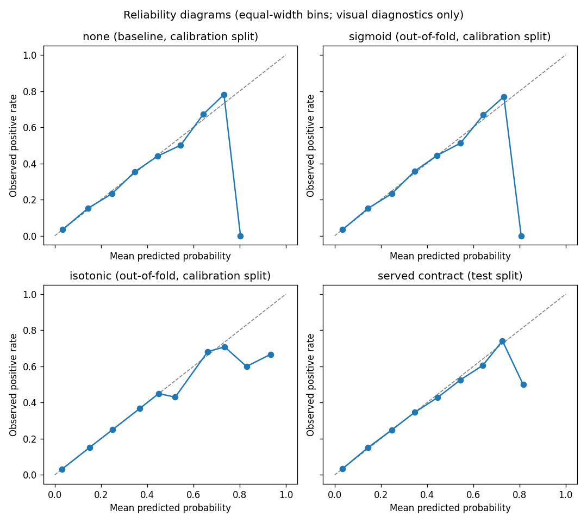
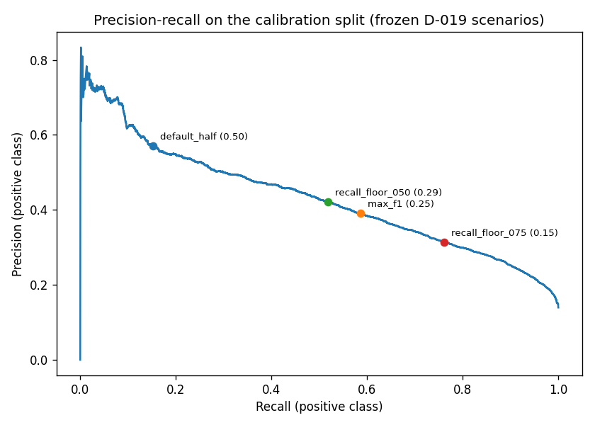

# P8 Calibration and Threshold Analysis Report

**Run date:** 2026-07-12

**Decisions:** D-018 (`calibration_method = none`) and D-019 (probability-only product policy)

**Regeneration:** `python -m src.calibration`

## Outcome

The frozen D-016 `HistGradientBoostingClassifier` remains the probability
contract. Neither sigmoid nor isotonic post-hoc calibration improved the
pre-declared primary criterion on calibration-split out-of-fold evidence.
The schema-version-2 artifact therefore stores `calibration_method = "none"`
and `calibrator = None`. The app continues to show an explicitly
uncalibrated probability and applies no decision threshold.

This is a valid P8 outcome rather than a failed calibration attempt: the
method-selection rule explicitly required retaining the baseline when no
candidate qualified.

## Leakage-safe protocol

- The base model was fitted once on the 177,576-row train split and remained
  frozen throughout P8.
- The 25,368-row calibration split (3,535 positives) supplied all D-018 and
  D-019 evidence. Sigmoid and isotonic used stratified five-fold
  cross-fitting; each row was predicted by a calibrator that did not fit on
  that row's fold.
- Calibrators consumed the frozen model's `decision_function` scores through
  scikit-learn 1.7.1 `CalibratedClassifierCV(FrozenEstimator(...),
  ensemble=False)`. They never consumed train or test rows.
- The paired bootstrap used 10,000 fixed-seed row resamples and percentile
  95% confidence intervals for `delta = candidate loss - reference loss`.
  Improvement required the interval's upper bound to be below zero.
- The 50,736-row test split participated only after D-018 and D-019 were
  frozen. Its recorded evaluation is now reproducible only as a deterministic
  regression check and cannot change either decision.

## D-018: calibration comparison

| Contract | Brier | Log loss | ROC-AUC | PR-AUC |
|---|---:|---:|---:|---:|
| none (baseline) | 0.096940 | 0.313828 | 0.827060 | 0.432421 |
| sigmoid (OOF) | 0.096965 | 0.313914 | 0.826973 | 0.431880 |
| isotonic (OOF) | 0.097000 | 0.316741 | 0.825299 | 0.425065 |

| Candidate vs. baseline | Loss | Mean delta | 95% CI | Result |
|---|---|---:|---:|---|
| sigmoid | Brier | +0.0000244 | [-0.0000056, +0.0000546] | Not adoptable |
| isotonic | Brier | +0.0000601 | [-0.0001115, +0.0002318] | Not adoptable |
| sigmoid | Log loss | +0.0000858 | [+0.0000014, +0.0001686] | Worse |
| isotonic | Log loss | +0.0029125 | [+0.0001510, +0.0069126] | Worse |

Sigmoid stayed within the project-defined 0.005 absolute ranking guard.
Isotonic lost 0.007356 PR-AUC and also failed that guard. Reliability plots
are diagnostic only and were not used to override the operational rule.

The machine-readable values are in [oof_metrics.csv](oof_metrics.csv),
[bootstrap_comparisons.csv](bootstrap_comparisons.csv), and the three
`reliability_calibration_*.csv` files in this directory.

## D-019: threshold trade-offs

The following scenarios were selected from a 0.01--0.99 grid using only the
selected contract's calibration-split probabilities. They describe behavior;
none is a clinically validated screening or diagnostic threshold, and none
is served by the app.

| Scenario | Threshold | Calibration recall | Precision | F1 | FP | FN |
|---|---:|---:|---:|---:|---:|---:|
| Default half | 0.50 | 0.152 | 0.571 | 0.240 | 403 | 2,998 |
| Maximum F1 | 0.25 | 0.586 | 0.391 | 0.469 | 3,225 | 1,462 |
| Recall floor 0.50 | 0.29 | 0.519 | 0.422 | 0.465 | 2,515 | 1,702 |
| Recall floor 0.75 | 0.15 | 0.761 | 0.314 | 0.444 | 5,883 | 844 |

The full grid is in
[threshold_table_calibration.csv](threshold_table_calibration.csv), and the
calibration/test scenario rows are in
[threshold_scenarios.csv](threshold_scenarios.csv).

## Official P8 test evaluation

The frozen `none` contract produced Brier 0.097381, log loss 0.314394,
ROC-AUC 0.826955, and PR-AUC 0.423065 on test. These values exactly match the
uncalibrated schema-v1 reference, as required by the selected contract.

| Scenario | Test recall | Precision | F1 | FP | FN |
|---|---:|---:|---:|---:|---:|
| Default half (0.50) | 0.157 | 0.563 | 0.246 | 862 | 5,958 |
| Maximum F1 (0.25) | 0.583 | 0.391 | 0.468 | 6,421 | 2,946 |
| Recall floor 0.50 (0.29) | 0.505 | 0.417 | 0.457 | 4,984 | 3,497 |
| Recall floor 0.75 (0.15) | 0.769 | 0.317 | 0.449 | 11,735 | 1,630 |

See [official_test_evaluation.csv](official_test_evaluation.csv) and
[reliability_test_contract.csv](reliability_test_contract.csv) for the exact
recorded values.

## Serving implications

- The artifact schema is version 2 and records D-018/D-019, the fixed
  calibration protocol, selected-contract OOF metrics, official P8 test
  metrics, frozen documentation scenarios, package versions, and exact
  feature order.
- The validator requires a fitted calibrator exactly when the declared method
  is `sigmoid` or `isotonic`; `none` requires `calibrator = None`. Schema-v1,
  incomplete, inconsistent, or unfitted contracts are rejected.
- The four P7 deployment profiles remain 0.3%, 60.0%, 70.0%, and 79.9%
  because the served probability function did not change. Their inputs and
  expectations are re-verified against the version-2 artifact.
- D-019 keeps estimation separate from decisions: the app remains
  probability-only and retains its medical disclaimer.
